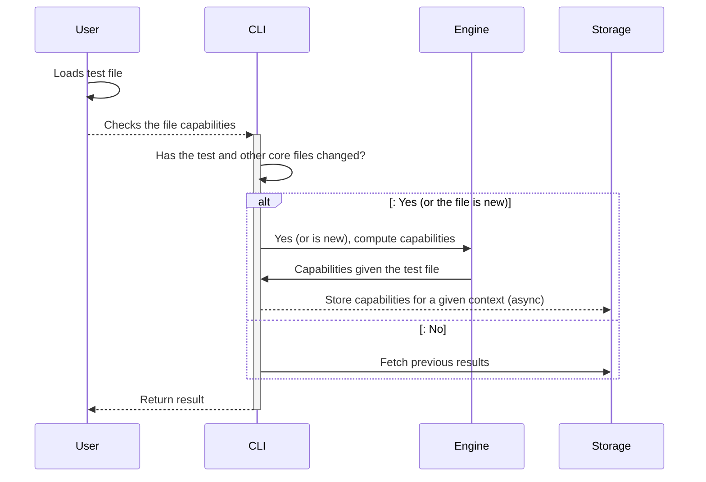
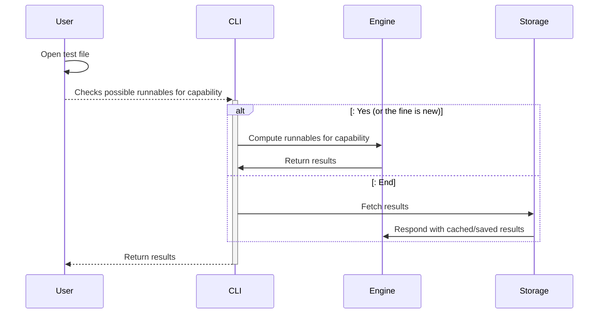
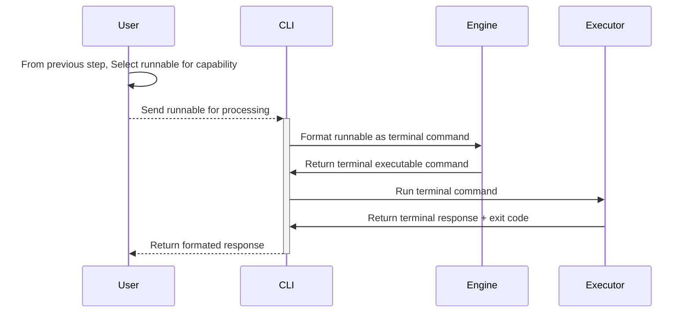

# Introduction

Design a utility that can be surfaced to (neo)vim that does one of the
following:

- Discovers the executable testing capabilities for a given file
- Runs anyone of these capabilities through the terminal or overseer.nvim
- Caches capability discovery.
- Search previous capability runs.
- Run a previous capability run.

## Terminology

### Capability

Any action runnable on the terminal that tests or runs performance evaluations
on the existing code.

## Design

### Flows

#### Discovering Runnables for the Capability

#### Executing runnables

Runnables will have a couple of details outlined

- The program language
- The framework
- The file name and path
- The current cursor position

### Storage Strategies

Storage strategies are based on

- Project Location
- Git branch (optional)
- File location and its content

These 3 points define how the runnable / capability is stored for fast
retrieval.

The storage layer will hold the following contents

- Runnables executed.
- Capabilities for a file path

#### Clear / Reset stored runnables and capabilities

If the git branch is deleted and storage is based on git branch, all runnables
stored for that branched are pruned from the storage layer.

If a user manually requests a reset, all the runnables and capabilities are
pruned from the storage layer either by the files SHA1 or for the entire
project.

If the size of the storage layer reaches more than 300mb, the entries will be
pruned by

- Git branch
- Last executed

Until the size is below 100mb.
